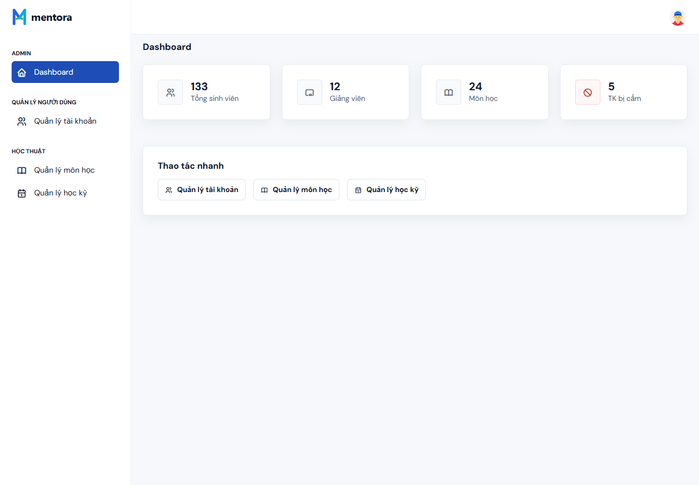
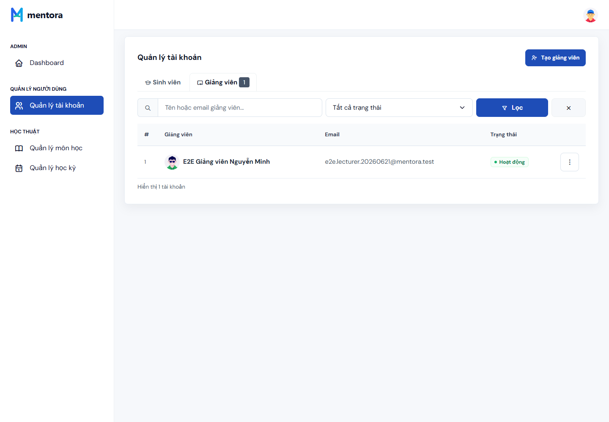
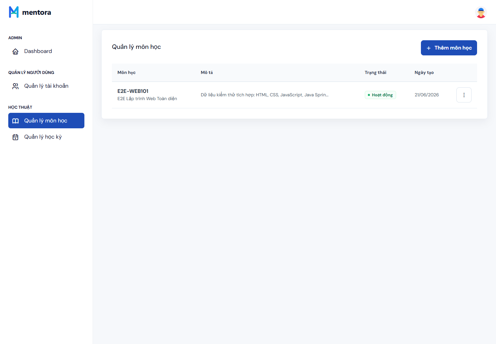
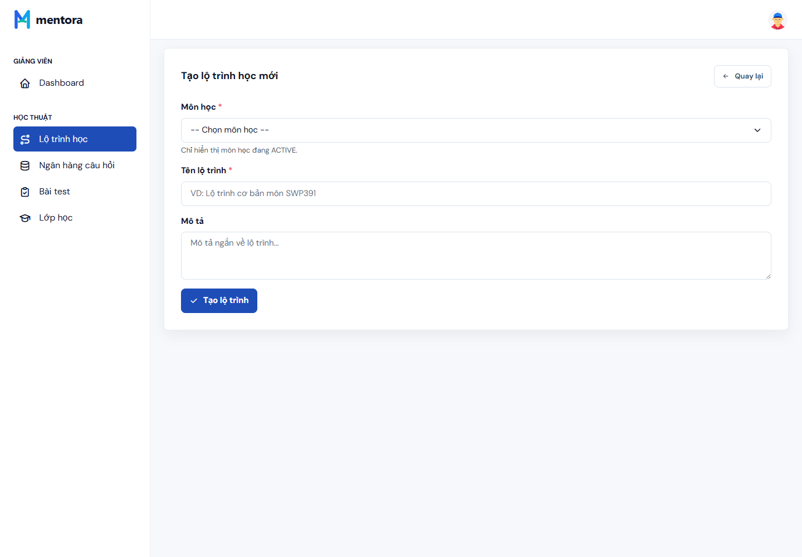
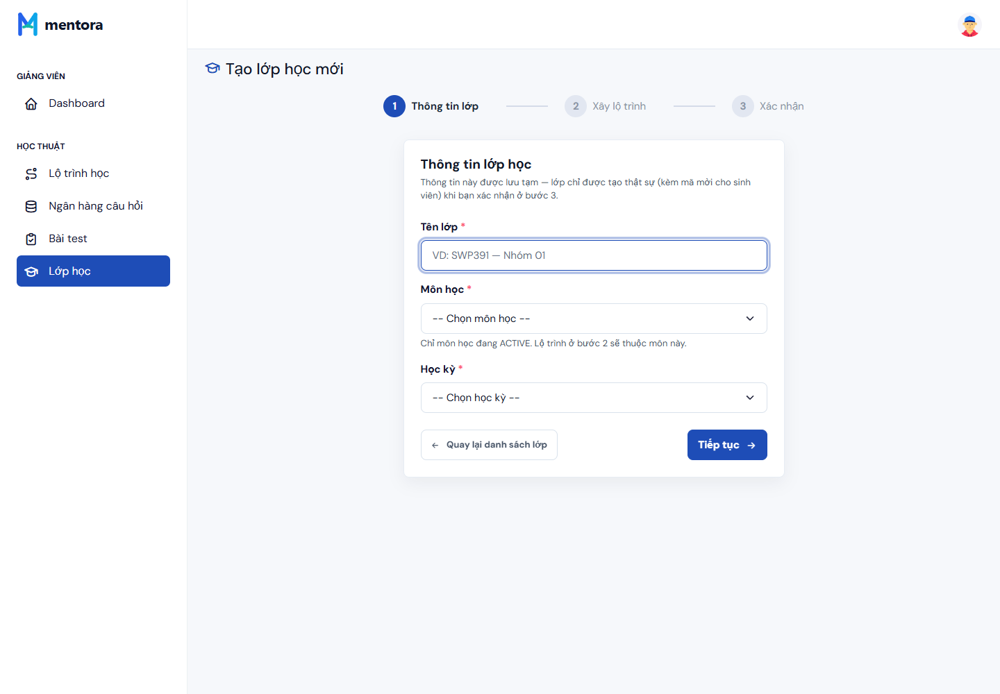
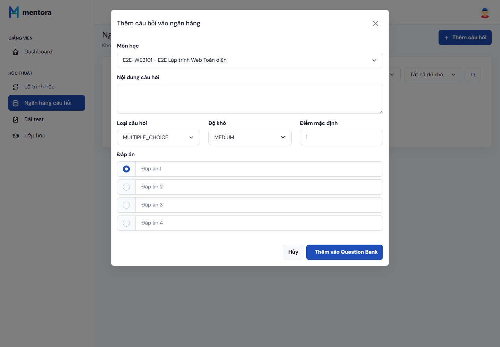
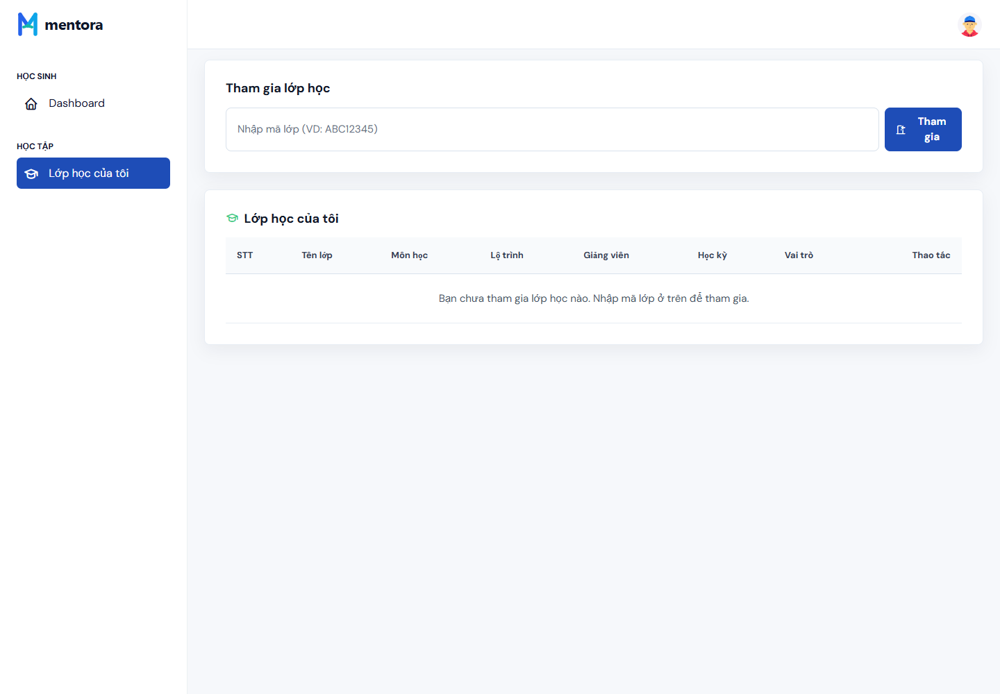
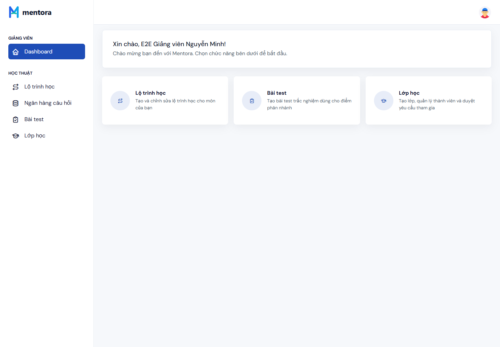
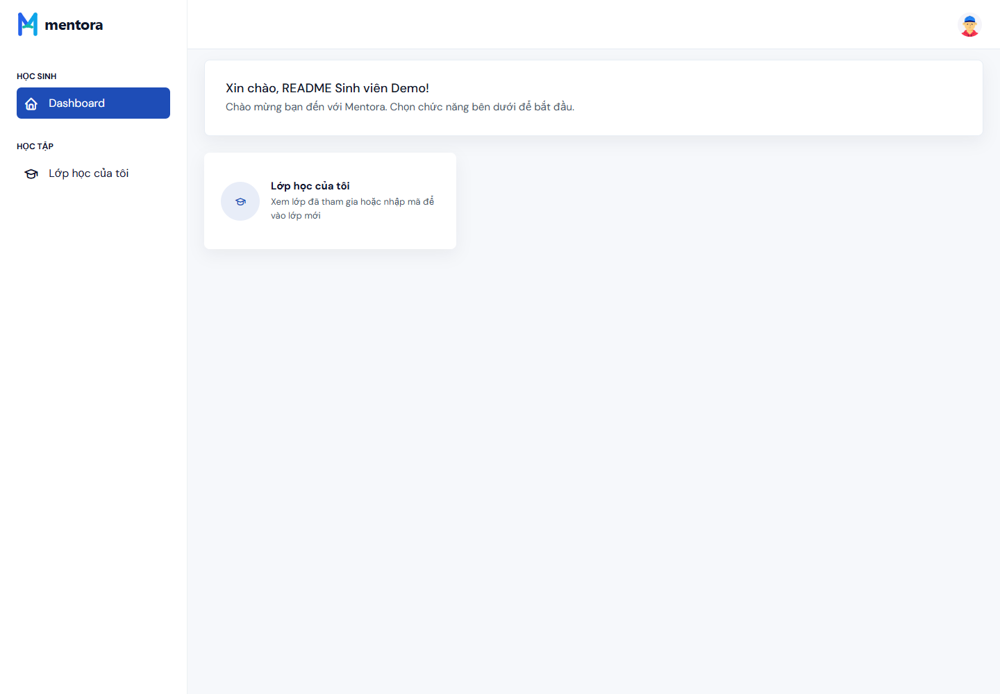

# Mentora

Mentora là hệ thống quản lý học tập được xây dựng cho môn SWP391. Dự án tập trung vào ba nhóm người dùng chính: quản trị viên, giảng viên và sinh viên.

## Chức năng chính

### Quản trị viên

- Quản lý tài khoản người dùng.
- Tạo tài khoản giảng viên.
- Khóa hoặc mở khóa tài khoản.
- Quản lý môn học, môn tiên quyết và học kỳ.

### Giảng viên

- Tạo lớp học và quản lý thành viên trong lớp.
- Tạo lộ trình học cho từng môn học.
- Thêm bài học, nội dung học tập và bài kiểm tra rẽ nhánh.
- Quản lý ngân hàng câu hỏi theo môn.
- Tạo bài đánh giá, import câu hỏi từ ngân hàng câu hỏi và công bố bài đánh giá.
- Bật hoặc ẩn các node học tập trong từng lớp.
- Trả lời câu hỏi của sinh viên trong Q&A.

### Sinh viên

- Đăng ký, đăng nhập và tham gia lớp bằng mã mời.
- Xem roadmap học tập của lớp.
- Học từng node và đánh dấu hoàn thành.
- Làm bài đánh giá và xem kết quả.
- Đặt câu hỏi trong Q&A của lớp.
- Trả lời Q&A khi được giảng viên gán vai trò TA.

## Hình ảnh minh họa luồng chính

| Đăng nhập | Admin dashboard |
| --- | --- |
|  |  |

| Quản lý tài khoản | Quản lý môn học |
| --- | --- |
|  |  |

| Giảng viên tạo lộ trình | Giảng viên tạo lớp |
| --- | --- |
|  |  |

| Ngân hàng câu hỏi | Sinh viên tham gia lớp |
| --- | --- |
|  |  |

| Giảng viên dashboard | Sinh viên dashboard |
| --- | --- |
|  |  |

## Công nghệ sử dụng

- Java 17
- Spring Boot 4.0.6
- Spring MVC
- Thymeleaf
- Spring Data JPA
- SQL Server
- Maven Wrapper
- Lombok
- Bootstrap, jQuery, ApexCharts

## Cấu trúc thư mục

```text
src/main/java/com/edunac/mentora
├── config        Cấu hình web, session, seed tài khoản admin
├── controller    Controller cho admin, lecturer, student và auth
├── domain        Entity và enum
├── dto           Form và dữ liệu truyền ra view
├── repository    Spring Data repository
└── service       Xử lý nghiệp vụ

src/main/resources
├── application.properties
├── templates     Giao diện Thymeleaf
└── static        CSS, JS, ảnh và thư viện frontend

src/test/java     Unit test và test kiểm tra cấu trúc view
docs              Tài liệu phân tích nghiệp vụ và nghiên cứu
```

## Cài đặt môi trường

Cần chuẩn bị:

- JDK 17 trở lên.
- SQL Server.
- Maven Wrapper đã có sẵn trong dự án, không cần cài Maven riêng.

Cấu hình database nằm trong:

```text
src/main/resources/application.properties
```

Nếu máy dùng tài khoản SQL Server khác thì sửa lại `username`, `password` và `url` cho phù hợp.

## Cài đặt database

Tạo database tên `MentoraDB`, sau đó chạy script SQL trong `src/main/resources/db/schema.sql` để tạo bảng và dữ liệu nền.

Các role bắt buộc:

```text
ADMIN
LECTURER
STUDENT
```

Ứng dụng không tự tạo schema vì `spring.jpa.hibernate.ddl-auto=none`, nên cần chạy script SQL trước khi start project.

## Chạy dự án

Trên Windows:

```powershell
.\mvnw.cmd spring-boot:run
```

Trên macOS hoặc Linux:

```bash
./mvnw spring-boot:run
```

Sau khi chạy thành công, mở:

```text
http://localhost:8080/login
```

## Tài khoản admin mặc định

Khi database đã có role `ADMIN`, project sẽ tự tạo tài khoản admin nếu tài khoản này chưa tồn tại:

```text
Email: admin1@mentora.com
Password: admin123
```

Tài khoản này chỉ dùng để chạy thử trong môi trường local.

## Lưu ý
Dự án được xây dựng cho mục đích học tập.
Hệ thống chưa được thiết kế để sử dụng trong môi trường production.
Không lưu mật khẩu, API key hoặc thông tin kết nối production trong repository.
