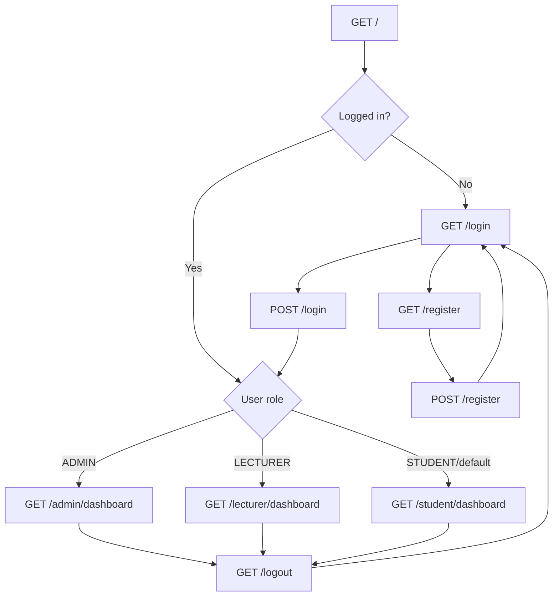
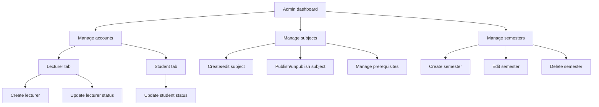
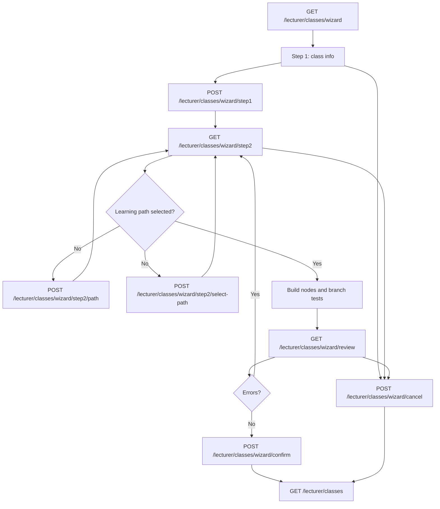
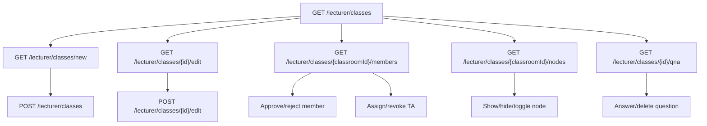
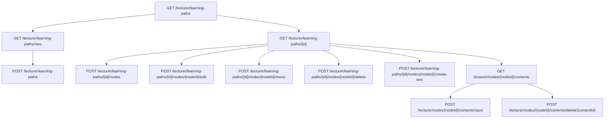
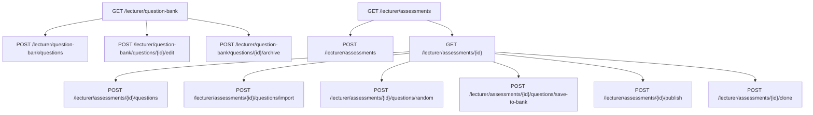
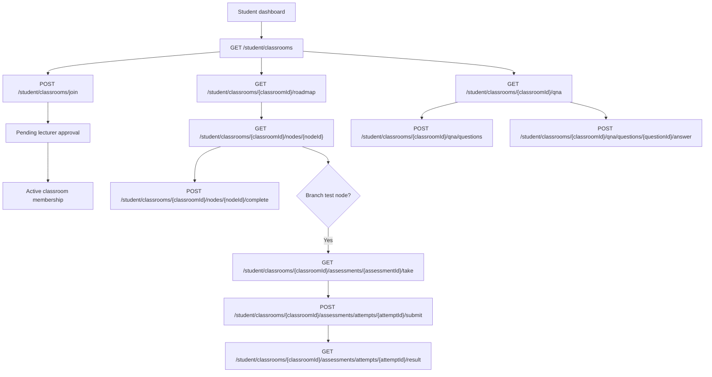
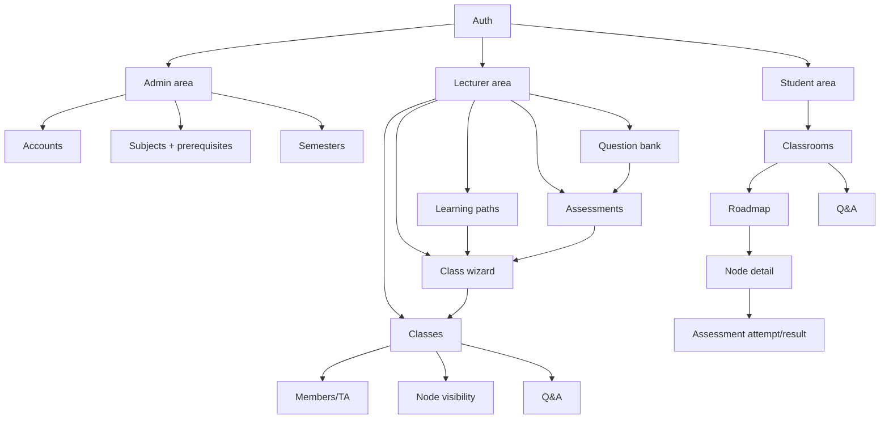

# Mentora Business Process

Last updated: 2026-07-02

This document was built from the existing Graphify output in `graphify-out/`
and checked against the current Spring MVC controllers and Thymeleaf templates.

## Graphify Basis

Graphify summary:

- Source graph: `graphify-out/graph.json`
- Report: `graphify-out/GRAPH_REPORT.md`
- Corpus: 488 files, about 1,058,271 words
- Graph size: 3,641 nodes, 7,918 edges, 309 communities

Key communities used for this process map:

- `Mentora Controller Authcontroller`
- `Mentora Controller Dashboardcontroller`
- `Mentora Controller Admin Admincontroller`
- `Admin Semester Management`
- `Mentora Controller Admin Subject`
- `Class Wizard Controller`
- `Classroom Controller`
- `Learning Path Controller`
- `Assessment Controller API`
- `Assessment Question Bank`
- `Node Content Controller`
- `Mentora Controller Student Studentclassroomcontroller`
- `Mentora Controller Student Studentroadmapcontroller`
- `Mentora Controller Student Studentlearningcontroller`
- `Mentora Controller Student Studentassessmentcontroller`

Graphify also highlights the main business hub nodes:

- `User`
- `AssessmentService`
- `Classroom`
- `Learning Progress & Node Builder`
- `Classroom Member Domain`
- `Question Bank Domain`

## Product Overview

Mentora is a role-based learning management application with three main user
groups:

- Admin manages accounts, subjects, prerequisites, and semesters.
- Lecturer creates learning paths, classrooms, assessments, question banks, and
  class Q&A/member workflows.
- Student joins classrooms, follows a roadmap, studies nodes, completes learning
  progress, takes assessments, and participates in Q&A.

The business process centers on this chain:

```text
Admin prepares academic data
-> Lecturer builds course structure and assessments
-> Lecturer opens classroom
-> Student joins classroom
-> Student follows roadmap
-> Student completes lessons/tests
-> Lecturer monitors and supports via members, visibility, and Q&A
```

## Role Entry Flow



Business rules:

- Unauthenticated root access redirects to login.
- Successful login stores `loggedInUser` in session.
- Existing sessions visiting login/register are redirected by role.
- Registration creates a student-style account flow and redirects to login.
- Logout invalidates the session.

Code anchors:

- `AuthController`
- `DashboardController`
- Templates: `auth/authentication-login`,
  `auth/authentication-register`, `admin/dashboard`,
  `lecturer/dashboard`, `student/dashboard`

## Admin Business Process

Admin prepares the master data and user access needed before lecturers and
students can operate smoothly.



### Admin Account Management

Purpose:

- View students and lecturers in a unified account page.
- Filter accounts by search/status.
- Create lecturer accounts.
- Update account status.

Main routes:

| Action | Route | Template |
| --- | --- | --- |
| View accounts | `GET /admin/accounts` | `admin/accounts` |
| Update account status | `POST /admin/accounts/{id}/status` | Redirects to accounts |
| Legacy lecturers page | `GET /admin/users` | Redirects to `tab=lecturers` |
| Create lecturer | `POST /admin/create-teacher` | Redirects to `tab=lecturers` |
| Legacy students page | `GET /admin/students` | Redirects to `tab=students` |

Primary service:

- `UserService`

### Admin Subject And Prerequisite Management

Purpose:

- Maintain the subject catalog.
- Publish/unpublish subjects.
- Define prerequisite relationships between subjects.

Main routes:

| Action | Route | Template |
| --- | --- | --- |
| View/manage subjects | `GET /admin/subjects` | `subjects/manage` |
| Save subject | `POST /admin/subjects/save` | Redirects to subjects |
| Delete subject | `POST /admin/subjects/delete/{id}` | Redirects to subjects |
| Publish subject | `POST /admin/subjects/publish/{id}` | Redirects to subjects |
| Unpublish subject | `POST /admin/subjects/unpublish/{id}` | Redirects to subjects |
| View prerequisites | `GET /admin/subjects/{subjectId}/prerequisites` | `subjects/prerequisite` |
| Add prerequisite | `POST /admin/subjects/{subjectId}/prerequisites/add` | Redirects to prerequisites |
| Remove prerequisite | `POST /admin/subjects/{subjectId}/prerequisites/delete/{prerequisiteSubjectId}` | Redirects to prerequisites |

Primary service:

- `SubjectService`

### Admin Semester Management

Purpose:

- Maintain academic semesters.
- Keep active semesters available for class creation.

Main routes:

| Action | Route | Template |
| --- | --- | --- |
| View semesters | `GET /admin/semesters` | `admin/semester/list` |
| Create semester | `POST /admin/semesters` | Redirects to semesters |
| Update semester | `POST /admin/semesters/{id}` | Redirects to semesters |
| Delete semester | `POST /admin/semesters/{id}/delete` | Redirects to semesters |

Primary service:

- `SemesterService`

## Lecturer Business Process

Lecturer owns the teaching setup. The lecturer side has two paths that can work
together:

- Standalone authoring: create learning paths, nodes, content, question bank,
  and assessments independently.
- Guided setup: use the class wizard to create a classroom by selecting subject,
  semester, learning path, branch tests, and validation rules.

### Lecturer Course Setup Wizard

Graphify connection:

- `LecturerClassWizardController` references `LearningPathService`,
  `AssessmentService`, `SubjectService`, `ClassroomService`,
  `SemesterRepository`, `BranchRuleService`, and `PathBuilderViewSupport`.

This is the strongest business process in the graph because it connects academic
data, learning paths, assessments, branching, and classroom creation.



Business rules:

- Step 1 stores temporary wizard state in session under `classWizard`.
- Changing subject after selecting a path clears the selected path.
- Step 2 can create a new path or reuse an existing path owned by the lecturer
  and matching the selected subject.
- Review blocks classroom creation if:
  - the learning path has no nodes;
  - a branch test node has no branch rule or assessment;
  - the attached assessment is not owned by the lecturer;
  - the attached assessment is not `PUBLISHED`.
- Review warns, but does not block, if:
  - a branch test misses PASS/FAIL child content;
  - a lesson node has no content.
- Confirm creates the classroom with status `OPEN`, clears the session wizard
  state, and shows the invite code.

Templates:

- `lecturer/course-setup/step1`
- `lecturer/course-setup/step2`
- `lecturer/course-setup/review`

### Lecturer Classroom Management

Purpose:

- Create/edit/delete classrooms.
- View invite code.
- Manage class Q&A.
- Manage members and TA assignments.
- Control learning node visibility per classroom.



Main controllers/services:

- `LecturerClassroomController`
- `LecturerMemberController`
- `LecturerClassroomNodeController`
- `ClassroomService`
- `ClassroomMemberService`
- `ClassroomNodeStatusService`
- `ClassroomQuestionService`

Main templates:

- `lecturer/class/list`
- `lecturer/class/form`
- `lecturer/class/members`
- `lecturer/class/nodes`
- `lecturer/class/qna`

### Lecturer Learning Path And Content Authoring

Purpose:

- Create and manage reusable learning paths.
- Add, edit, move, clone, and delete learning nodes.
- Attach branch tests to nodes.
- Add node contents such as text/media resources.



Business rules:

- Learning paths are scoped to the creator.
- Paths can be grouped by subject on the list screen.
- Paths already attached to classrooms are identified in the list.
- Branch tests can create a draft assessment and attach it to a node.
- Redirect targets are constrained to internal lecturer URLs.

Main controllers/services:

- `LecturerLearningPathController`
- `LecturerNodeContentController`
- `LearningPathService`
- `LearningNodeService`
- `NodeContentService`
- `AssessmentService`
- `BranchRuleService`

Main templates:

- `lecturer/learning-path/list`
- `lecturer/learning-path/form`
- `lecturer/learning-path/builder`
- `lecturer/learning/node-contents`

### Lecturer Assessment And Question Bank

Purpose:

- Maintain a reusable question bank by subject.
- Create assessments in `DRAFT`.
- Add questions manually or import/randomize from question bank.
- Publish assessments for use in branch tests and student attempts.
- Clone assessments into new draft versions.



Business rules:

- Assessment list separates `DRAFT` from published/archived assessments.
- New assessments default to `BRANCHING_TEST`, `SELF_PACED`, 30 minutes, and
  total score 10.
- Assessment detail allows edits only while the assessment is `DRAFT`.
- Published assessments are required before a class wizard branch test can pass
  validation.
- Question bank search supports subject, keyword, difficulty, and type filters.

Main controllers/services:

- `LecturerAssessmentController`
- `LecturerQuestionBankController`
- `AssessmentService`
- `QuestionBankService`
- `SubjectService`

Main templates:

- `lecturer/assessment/list`
- `lecturer/assessment/form`
- `lecturer/assessment/detail`
- `lecturer/question-bank/list`

## Student Business Process

Student work begins with joining a classroom, then proceeds through roadmap,
node learning, assessments, and class Q&A.



### Student Classroom Membership

Purpose:

- View joined classrooms and pending requests.
- Join a classroom using invite code.
- Wait for lecturer approval before accessing active class features.

Main routes:

| Action | Route | Template |
| --- | --- | --- |
| View classrooms | `GET /student/classrooms` | `student/classroom/list` |
| Join by invite code | `POST /student/classrooms/join` | Redirects to classroom list |
| View role status | `GET /student/classrooms/{classroomId}/role-status` | JSON response |

Primary services:

- `ClassroomMemberService`

### Student Roadmap And Learning Progress

Purpose:

- See the classroom roadmap.
- Open accessible learning nodes.
- Read node content.
- Mark nodes as completed.
- Respect visibility and prerequisite/branch access rules.

Main routes:

| Action | Route | Template |
| --- | --- | --- |
| View roadmap | `GET /student/classrooms/{classroomId}/roadmap` | `student/classroom/roadmap` |
| Legacy node list | `GET /student/classrooms/{classroomId}/nodes` | Redirects to roadmap |
| View node detail | `GET /student/classrooms/{classroomId}/nodes/{nodeId}` | `student/learning/node-detail` |
| Complete node | `POST /student/classrooms/{classroomId}/nodes/{nodeId}/complete` | JSON response |

Business rules:

- Unauthenticated node access redirects to login.
- Student can view a node only if `StudentRoadmapService.canAccessNode` allows it.
- Node detail includes previous/next visible nodes.
- Branch test nodes load a `BranchRule` so the UI can show the test action.
- Completing a node returns a `NodeProgressResponse`.

Primary services:

- `StudentRoadmapService`
- `NodeProgressService`
- `NodeContentService`
- `BranchRuleService`

### Student Assessment Attempt

Purpose:

- Start or resume an assessment attempt.
- Prevent duplicate submitted attempts from being retaken.
- Submit answers.
- View result.

Main routes:

| Action | Route | Template |
| --- | --- | --- |
| Take assessment | `GET /student/classrooms/{classroomId}/assessments/{assessmentId}/take` | `student/assessment/take` |
| Submit attempt | `POST /student/classrooms/{classroomId}/assessments/attempts/{attemptId}/submit` | Redirects to result |
| View result | `GET /student/classrooms/{classroomId}/assessments/attempts/{attemptId}/result` | `student/assessment/result` |

Business rules:

- If a submitted attempt already exists, the student is redirected to result.
- Starting an attempt may immediately redirect to result if the attempt is
  already submitted.
- Answer parameters use the `answers_{questionId}` format.
- Grading and result access are delegated to `StudentAssessmentService`.

Primary services:

- `StudentAssessmentService`
- `AssessmentService`

### Student And TA Q&A

Purpose:

- Student asks classroom questions.
- Lecturer answers and moderates questions.
- TA members can answer as class members.

Main routes:

| Role | Action | Route | Template |
| --- | --- | --- | --- |
| Student/TA | View Q&A | `GET /student/classrooms/{classroomId}/qna` | `student/classroom/qna` |
| Student/TA | Ask question | `POST /student/classrooms/{classroomId}/qna/questions` | Redirects to Q&A |
| Student/TA | Answer question | `POST /student/classrooms/{classroomId}/qna/questions/{questionId}/answer` | Redirects to Q&A |
| Lecturer | View Q&A | `GET /lecturer/classes/{id}/qna` | `lecturer/class/qna` |
| Lecturer | Answer question | `POST /lecturer/classes/{id}/qna/questions/{questionId}/answer` | Redirects to Q&A |
| Lecturer | Delete question | `POST /lecturer/classes/{id}/qna/questions/{questionId}/delete` | Redirects to Q&A |

Business rules:

- Student Q&A checks active classroom membership.
- `MemberRole.TA` enables TA mode in the student Q&A screen.
- Lecturer Q&A is restricted to classes owned by the lecturer.

Primary service:

- `ClassroomQuestionService`

## End-To-End Business Scenarios

### Scenario 1: Admin Opens A New Teaching Period

1. Admin logs in.
2. Admin creates or updates semester data.
3. Admin creates or updates subjects.
4. Admin publishes subjects that lecturers may use.
5. Admin configures subject prerequisites where needed.
6. Lecturer can now create learning paths/classes using active subjects and
   semesters.

### Scenario 2: Lecturer Creates A Class With A Branching Roadmap

1. Lecturer logs in and opens the class wizard.
2. Lecturer enters class name, subject, and semester.
3. Lecturer creates or selects a learning path.
4. Lecturer adds learning nodes and branch test nodes.
5. Lecturer attaches/publishes assessments for branch test nodes.
6. Lecturer reviews validation errors and warnings.
7. Lecturer confirms the wizard.
8. System creates the classroom, sets it `OPEN`, and returns an invite code.
9. Lecturer shares the invite code with students.

### Scenario 3: Student Joins And Learns

1. Student logs in.
2. Student opens classroom list.
3. Student submits invite code.
4. System creates a pending join request.
5. Lecturer approves the request in member management.
6. Student opens the classroom roadmap.
7. Student opens accessible nodes and studies content.
8. Student marks nodes complete.
9. If a branch test node is reached, student takes the assessment.
10. Student views result and continues through the roadmap according to progress
    and branch logic.

### Scenario 4: Lecturer Maintains Assessments

1. Lecturer creates or edits question bank items by subject.
2. Lecturer creates an assessment draft.
3. Lecturer adds questions manually, imports selected bank questions, or uses
   random preview/import.
4. Lecturer reviews the assessment detail.
5. Lecturer publishes the assessment.
6. Published assessment can be attached to branch test nodes and taken by
   students.

### Scenario 5: Classroom Support Through Q&A

1. Student opens classroom Q&A.
2. Student submits a question.
3. Lecturer views questions from lecturer class Q&A.
4. Lecturer answers or deletes questions.
5. If a student is assigned as TA, the student Q&A page enables TA mode and the
   TA can answer as a class member.

## Screen Flow Summary



## Controller-To-Template Map

| Area | Controller | Route base | Main templates |
| --- | --- | --- | --- |
| Auth | `AuthController` | `/`, `/login`, `/register`, `/logout` | `auth/authentication-login`, `auth/authentication-register` |
| Dashboard | `DashboardController` | `/admin/dashboard`, `/lecturer/dashboard`, `/student/dashboard` | `admin/dashboard`, `lecturer/dashboard`, `student/dashboard` |
| Admin accounts | `AdminController` | `/admin` | `admin/accounts` |
| Admin subjects | `AdminSubjectController` | `/admin/subjects` | `subjects/manage` |
| Admin prerequisites | `AdminPrerequisiteController` | `/admin/subjects/{subjectId}/prerequisites` | `subjects/prerequisite` |
| Admin semesters | `AdminSemesterController` | `/admin/semesters` | `admin/semester/list` |
| Lecturer classes | `LecturerClassroomController` | `/lecturer/classes` | `lecturer/class/list`, `lecturer/class/form`, `lecturer/class/qna` |
| Lecturer class wizard | `LecturerClassWizardController` | `/lecturer/classes/wizard` | `lecturer/course-setup/step1`, `step2`, `review` |
| Lecturer class members | `LecturerMemberController` | `/lecturer/classes/{classroomId}/members` | `lecturer/class/members` |
| Lecturer class nodes | `LecturerClassroomNodeController` | `/lecturer/classes/{classroomId}/nodes` | `lecturer/class/nodes` |
| Lecturer paths | `LecturerLearningPathController` | `/lecturer/learning-paths` | `lecturer/learning-path/list`, `form`, `builder` |
| Lecturer node contents | `LecturerNodeContentController` | `/lecturer/nodes/{nodeId}/contents` | `lecturer/learning/node-contents` |
| Lecturer assessments | `LecturerAssessmentController` | `/lecturer/assessments` | `lecturer/assessment/list`, `form`, `detail` |
| Lecturer question bank | `LecturerQuestionBankController` | `/lecturer/question-bank` | `lecturer/question-bank/list` |
| Student classrooms | `StudentClassroomController` | `/student/classrooms` | `student/classroom/list`, `student/classroom/qna` |
| Student roadmap | `StudentRoadmapController` | `/student/classrooms/{classroomId}/roadmap` | `student/classroom/roadmap` |
| Student learning | `StudentLearningController` | `/student/classrooms/{classroomId}/nodes` | `student/learning/node-detail` |
| Student assessments | `StudentAssessmentController` | `/student/classrooms/{classroomId}/assessments` | `student/assessment/take`, `student/assessment/result` |

## Process Boundaries And State

Important session state:

- `loggedInUser`: current authenticated user.
- `classWizard`: temporary lecturer wizard state before a classroom is created.

Important status fields:

- Account status: controlled by admin account actions.
- Subject status: publish/unpublish controls active use.
- Semester status: active semesters are available for class setup.
- Classroom status: wizard creates classroom as `OPEN`.
- Assessment status: `DRAFT` blocks class-wizard branch test validation;
  `PUBLISHED` is required for student-facing branch tests.
- Classroom member status: pending request must be approved before active access.
- Classroom member role: `TA` enables TA behavior in student Q&A.
- Node visibility status: lecturer can show/hide nodes per classroom.
- Attempt status: submitted attempts redirect to result.

## Gaps To Validate With Product Owner

These points are visible from the graph/code and should be confirmed when turning
this into formal product documentation:

- Whether registration always creates a student account or supports role choice
  elsewhere.
- Whether subject prerequisites affect student roadmap access directly, or only
  course setup/academic planning.
- Whether assessment result should unlock branch PASS/FAIL routing immediately
  or through a separate progress service rule.
- Whether archived assessments remain visible to lecturers but unavailable for
  new branch test assignment.
- Whether hidden classroom nodes should be invisible in all student views or only
  blocked from opening.
